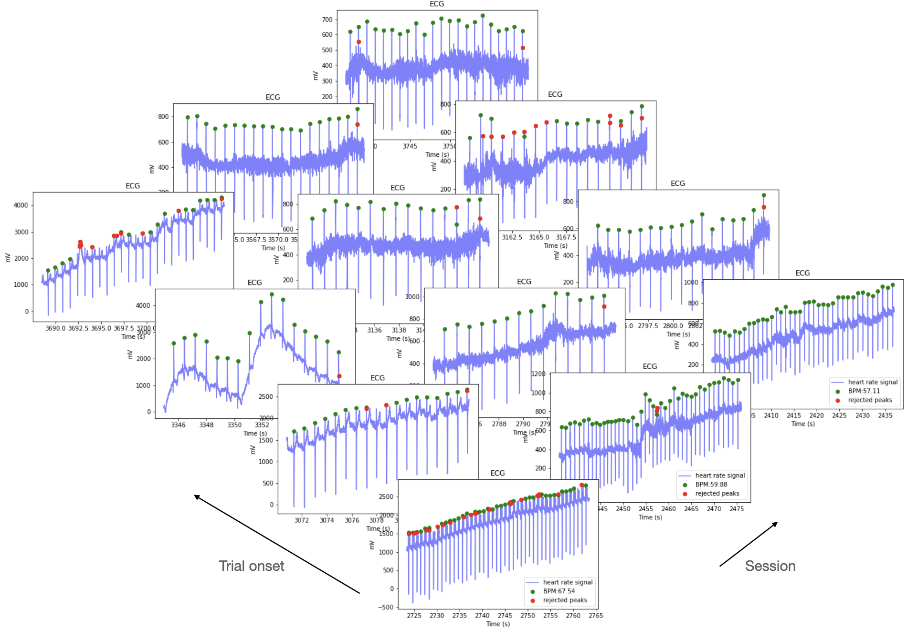
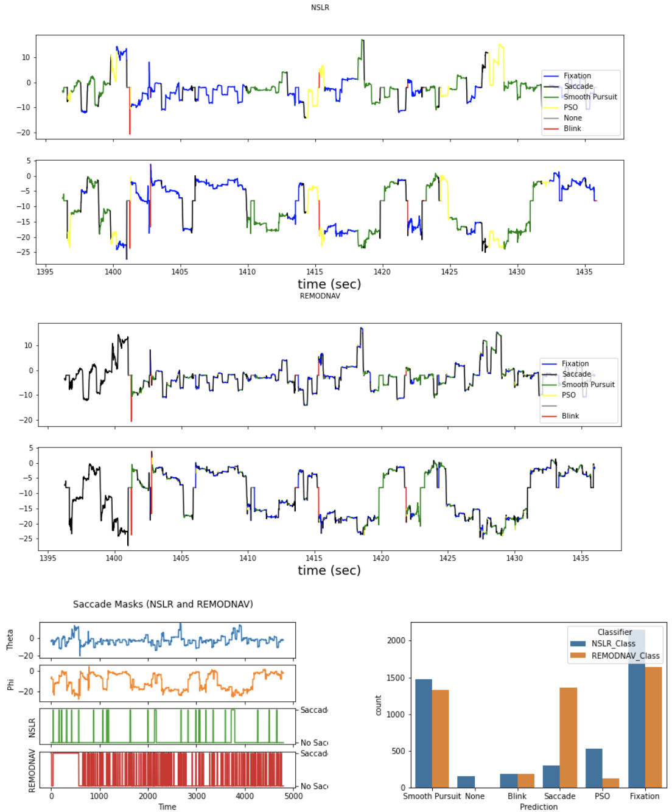
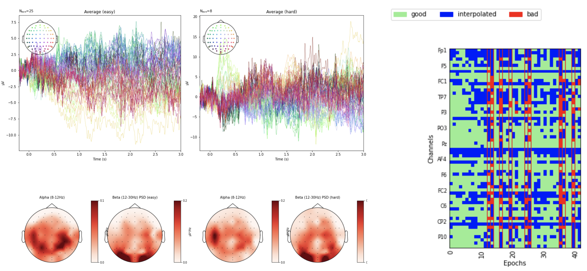
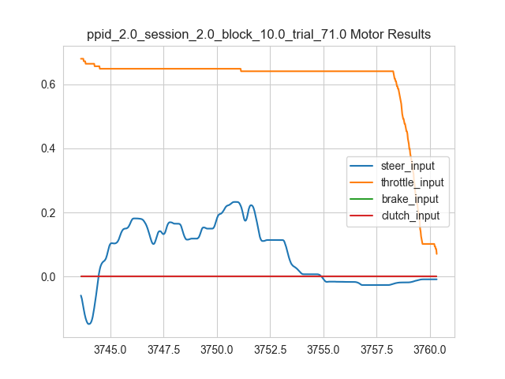
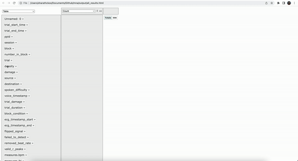

# Multimodal Neurophysiological Analysis

## MNA

A lightweight, Python package for analysis of eye tracking, electroencephalography (EEG), electrocardiogram (ECG) and 
other generic, time-series data created for [LIINC](https://liinc.bme.columbia.edu/). 
Also supports epoch- or event-level data quality reports and interactive review of data.

**Why use this package?**
- standardization of pre-processing and analysis of raw, time-series data,
- quality indices for each modality to compare data collection and processing across datasets,
- simplified output so researchers can aggregate multiple datasets from varied sources and visualize the results in an interactive way.

## Table of Contents
- [Setup](#setup)
- [Raw data and events](#Raw data and events)
- [Modality analyses](#Modality-analyses)
  - [Electrocardiogram (ECG)](#Electrocardiogram-(ECG))
  - [Eye tracking (ET)](#Eye tracking-(ET))
  - [Electroencephalography (EEG)](#Electroencephalography-(EEG))
  - [Motor](#Motor)
- [Interactive plotting](#interactive-plotting)

## Setup

Pull this repo

```git pull ...```

Set up a conda environment by running the following command

```conda env create --name mna --file=environment.yml ```

Activate the environment

```conda activate mna```

## Raw data and events

MNA requires: 
- a nested dictionary containing the raw data,
- an event matrix containing trial start and end timestamp, and 
- an event column that describes the trial or event.

Variable names below will refer to the example in `notebooks/process_session.ipynb`

### Raw data

The primary data structure (e.g. `rns_data` in `notebooks/process_session.ipynb`) contains raw, time-series, data is 
a nested dictionary of the structure:

- **key** representing `stream_name`
  - numpy array of raw values `shape (c x n)`
  - numpy array of timestamps (in seconds) `shape (1 x n)`
  - a dictionary with a **list** `ChannelNames` `shape (c)` and **int** `NominalSamplingRate`

Example:
```python
{'Unity_MotorInput': [numpy.array([[ 5.18798828e-04,  5.18798828e-04,  5.18798828e-04, ...,
          -7.29370117e-03, -7.29370117e-03, -7.29370117e-03],
         [ 0.00000000e+00,  0.00000000e+00,  0.00000000e+00, ...,
           0.00000000e+00,  0.00000000e+00,  0.00000000e+00]]),
  numpy.array([2436.05086231, 2436.07311362, 2436.09533963, ..., 3767.04157113,
         3767.06377661, 3767.08597653]),
  {'StreamName': 'Unity.MotorInput',
   'ChannelNames': ['steer_input',
    'throttle_input',
    'brake_input',
    'clutch_input'],
   'NominalSamplingRate': 1}],
 ...
 }
```

### Event DataFrame

* A Pandas DataFrame that contains epoch-related events, including `trial_start_time`, `trial_end_time`, 
epoch identifiers (e.g. `particpant_id`, `trial_number`) and an event identifier (e.g. `spoken_difficulty`). You will 
need to integer encode events for EEG analysis.

Example DataFrame where we process epochs (trials) and events which represent concurrently-collected voice 
data which will be used to filter epochs for EEG analysis:

| index |trial_start_time|trial_end_time|ppid|session|trial|spoken_difficulty|spoken_difficulty_encoded|
|-------|----------------|--------------|----|-------|-----|-----------------|-------------------------|
| 0     |0.000000        |2534.338858   |2.0 |2.0    |1.0  |                 |                         |
| 1     |2534.348858     |2547.114877   |2.0 |2.0    |2.0  |easy             |1.0                      |
| 2     |2547.124877     |2559.498461   |2.0 |2.0    |3.0  |easy             |1.0                      |
| 3     |2559.508461     |2574.974257   |2.0 |2.0    |4.0  |                 |                         |
| 4     |2574.984257     |2591.728904   |2.0 |2.0    |5.0  |                 |                         |

## Modality analyses

### Electrocardiogram (ECG)

<div style="text-align: center;">

</div>

ECG analysis relies on the [HeartPy](https://github.com/paulvangentcom/heartrate_analysis_python) package to identify R-peaks in the QRS complex. 

Example call:
```python
process_session_ecg(rns_data, event_df,plot_frequency=20,plot_ecg_snippet=40)
```

#### Returns:

Appended to the Event DataFrame (epoch- or event-wise):

| Column output           | type  | description                                                                |
|-------------------------|-------|----------------------------------------------------------------------------|
| failed_to_detect        | bool  | was the entire interval of poor quality or were there no R-peaks detected? |
| ecg_timestamp_start     | float | start time of ECG waveform                                                 |
| ecg_timestamp_end       | float | end time of ECG waveform                                                   |
| flipped_signal          | bool  | was the signal detected as inverted  and required flipping?                |
| removed_beat_rate       | float | proportion of valid beats detected within interval                         |
| valid_r_peaks           | list  | list of timestamps (global) where valid R peaks were detected              |
| measures.(bpm, ibi,...) | float | prepended to [HeartPy time-series measures](float)                         |

Plots:

| output/                                   | description                                            |
|-------------------------------------------|--------------------------------------------------------|
| ecg_{timestamp_start}_{timestamp_end}.png | a snippet of ECG waveform with<br/> overlaid beats detected |


### Eye tracking (ET)
<div style="text-align: center;">

</div>

Eye tracking analysis uses internal MNA, [NSLR](https://github.com/pupil-labs/nslr-hmm) and 
[REMoDNaV](https://github.com/psychoinformatics-de/remodnav) packages to classify events such as blinks, fixations, saccades, etc. 

MNA is tested on data from the HTC VIVE Pro Eye headset.

Example call:
```python
process_session_eye(rns_data, post_processed_event_df, classifiers = ['NSLR', 'REMoDNaV'], 
                    detect_blink=True,plot_frequency=20,plot_ecg_snippet=40)
```

#### Returns:

Appended to the Event DataFrame (epoch- or event-wise), where `classifier` can be **NSLR** and `class` can be
**Fixation**, for example:

| Column output                        | type  | description                                               |
|--------------------------------------|-------|-----------------------------------------------------------|
| {classifier}\_count\_{Class}         | float | number of `class` events in the epoch                     |
| {classifier}\_first_onset\_{Class}   | float | timestamp (global) of the first `class` event in the epoch |
| {classifier}\_mean_duration\_{Class} | float | mean duration (seconds) of `class` events in the epoch    |
| {classifier}\_class_onsets           | list  | (time_of_event, timestamp) per event               |

Plots:

| output/                                                       | description                                                                  |
|---------------------------------------------------------------|------------------------------------------------------------------------------|
| classifier_counts_{timestamp_start}_{timestamp_end}.png       | a frequency plot comparing classifiers                                       |
| saccade_masks_{timestamp_start}_{timestamp_end}.png           | time series with masked event to<br/> compare classifiers (default saccades) |
| {classifier}\_segments\_{timestamp_start}_{timestamp_end}.png | time series with overlaid segments                                           |

### Electroencephalography (EEG)

<div style="text-align: center;">

</div>

EEG analysis uses internal MNA, [MNE-Python](https://mne.tools/stable/index.html) and 
[autoreject](https://autoreject.github.io/stable/index.html) packages to mark channels for interpolation,
baseline analysis, etc. 

MNA is tested on data from the Biosemi 64-channel headset and plots currently only support binary events.

Example call:
```python
process_session_eeg(rns_data, post_processed_event_df,
                    event_column='spoken_difficulty_encoded', run_autoreject=True, run_ica=True)
```

#### Returns:

Appended to the Event DataFrame (epoch- or event-wise), using events from the `event_column` which contain
integer-encoded events for MNE analysis, for example:

| Column output | type | description                                                                   |
|---------------|------|-------------------------------------------------------------------------------|
| autorejected  | bool | whether that epoch was rejected or not from analysis<br/> prior to plot generation |

Plots:

| output/               | description                                                                                                               |
|-----------------------|---------------------------------------------------------------------------------------------------------------------------|
| eeg_{timestamp_start}_{timestamp_end}.png               | averaged evoked response and PSD topo maps for each event type in `event_column`                                          |
| autoreject_preica_{timestamp_start}_{timestamp_end}.png | epoch-level summary from autoreject that summarizes the amount of interpolation or bad epochs dropped, channel-by-channel |
| ica_{timestamp_start}_{timestamp_end}.png               | 20 (default) ICA components                                                                                               |


### Motor

<div style="text-align: center;">

</div>

While this section refers to "motor" channels, you can calculate total displacement or change from simple channels
that don't require pre-processing. Motor data in this example uses four channels from a steering wheel setup: 
`steer`, `throttle`, `brake`, `clutch`.


Example call:
```python
process_session_motor(rns_data, post_processed_event_df, motor_channel='Unity_MotorInput',
                      plot_motor_result = True, plot_motor_snippet = 30, plot_frequency = 10)
```

#### Returns:

Appended to the Event DataFrame (epoch- or event-wise), a feature per `motor` channel is extracted, for example:

| Column output | type  | description                                                            |
|---------------|-------|------------------------------------------------------------------------|
| abs_sum_{motor}\_input  | float | absolute sum of the sample-to-sample displacement of a `motor` channel |

Plots:

| output/              | description                                        |
|----------------------|----------------------------------------------------|
| {trial_no}_motor.png | change in motor activity in each channel over time |

## Interactive plotting

<div style="text-align: center;">

</div>

MNA uses [pivottablejs](https://pypi.org/project/pivottablejs/) to allow real-time synthesis of multimodal analysis
results. 

You can either generate an HTML using the default `pivot_ui` call after a session-level analysis or after concatenating
sessions into a single DataFrame, `post_processed_event_df`. An example call::

```python
from pivottablejs import pivot_ui
pivot_ui(post_processed_event_df, outfile_path=f"../output/post_processed_event_df.html");
```

The gif above shows an example where a user wants to quickly check if there is a linear trend between fixation duration 
and noise density, by participant. 